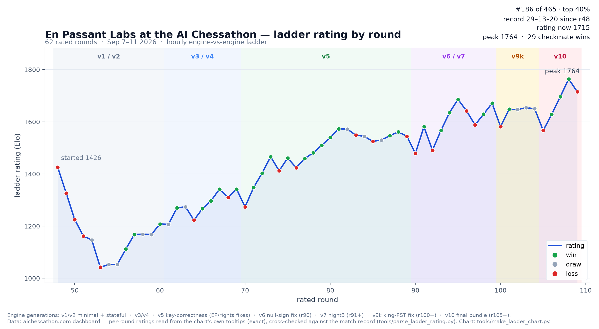
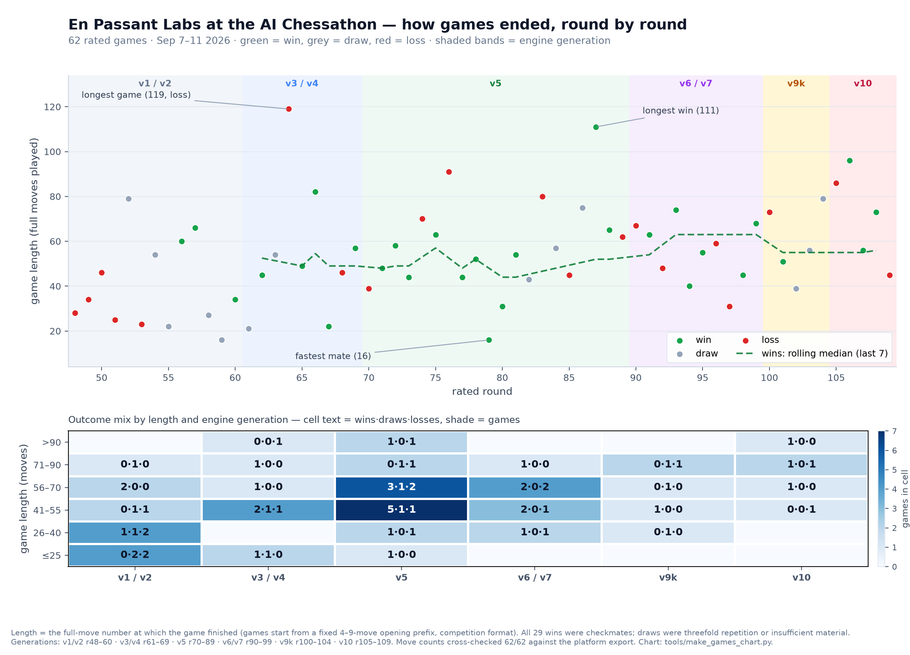

# En Passant Labs — AI Chessathon 2026

A from-scratch chess engine built in five days by one human operator and a
team of autonomous AI agents — with every experiment, audit and dead end
kept on the record.



## Result

- **29W · 13D · 20L** over 62 rated ladder games (Sep 7–11, 2026)
- Final rating **1715**, peak **1764** (r108) · **#186 of 465** teams (top 40%)
  at the closing standings
- **All 29 wins by checkmate**
- Event constraints: 1 CPU core, 2 GB RAM, no GPU, no network, 120 s + 0.5 s
  clock, ≤ 50 MB submission. Python + numba/numpy + python-chess only.



## What this is

`agent.py` exposes the competition interface:

```python
get_move(fen: str, time_left_ms: int) -> str   # returns a legal UCI move
```

Everything behind it is written in this repo, during the event:

- **`engine/board.py`** — bitboard position with zobrist keys, legal move
  generation, make/unmake; perft-verified against python-chess.
- **`engine/search.py`** — negamax + alpha-beta, iterative deepening,
  transposition table, quiescence search, null-move pruning, LMR,
  killer/history ordering, mate-distance drive.
- **`engine/eval.py`** — hand-authored evaluation: material, piece-square
  tables, pawn structure (doubled / isolated / passed), mobility, king
  safety, bishop pair, tempo, endgame conversion terms.
- **`engine/tt.py`, `engine/time.py`** — table + clock management.
  Everything numba-jitted; the search chain is warmed up inside the 60 s
  init budget, with a python-chess oracle fallback so the agent never
  returns an illegal move, crashes, or hangs.

## How it was built — the part worth reading

The build ran as an agentic pipeline with a hard verification stack:

- **A/B tree gates.** Every engine change plays 24–216 engine-vs-engine
  games at ladder time control against the current reference build, pooled
  over multiple seeds with pre-declared decision bands (≥ 0.55 ship,
  ≤ 0.45 reject, in between = unresolved). A single 24-game gate is not
  enough signal — our own repeats spanned 0.417–0.562 on identical configs.
- **Adversarial audits.** Between build rounds, architecture audits ran as
  independent read-only agents (different frontier models, fresh context)
  tasked to *refute* the builders. They found real defects the builders
  missed — see below.
- **Correctness-first shipping.** A change that fixes a genuine defect can
  ship on a *neutral* gate if the mechanism is proven; a change that only
  promises strength must win its gate. Both kinds are on the record.

### What the audits caught (all fixed, all gated)

- A **wrong-sign null-move cutoff** — one missing negation on one score
  path; fixing it scored **0.708** in its gate — one of the strongest
  gate results of the build — and shipped as the v6 build the next morning.
- An **inverted king piece-square table** — the engine punished its own
  castled king and rewarded the enemy's, across all 64 squares.
- A **doubled-pawn file-index bug** — all twelve loop iterations sampled
  the same file, so doubled pawns outside the a-file scored zero.
- **En-passant canonicalisation** — two code paths disagreed on when an ep
  square exists, silently breaking repetition identity in rare positions.
- **Mate scored as a draw** at the 50-move boundary.

### Negative results, kept on purpose

Not everything worked, and the record says so:

- A **Texel-style tuner** was built and validated — its first fit scored
  0.104 (0W–19L–5D) in the gate and was rejected; the hand eval shipped.
- A **compensation-aware eval clamp** measured 0.417 — rejected.
- A **rook+bishop piece-square variant** measured 0.481 — rejected.
- **2× thinking time** repaired 0 of 8 sampled collapse positions.

## Repo map

| Path | What's in it |
|---|---|
| `agent.py`, `engine/` | the submission (agent + engine source) |
| `results/` | every gate log, match PGN, SF16 blunder review, leak-suite probe |
| `docs/agentic-process/` | mission briefs + raw agent session traces (~40 runs) |
| `docs/research/` | research knowledge base + 10 independent audit reports |
| `PROCESS.md` | master log: decisions, ladder results, post-mortems |
| `BUILD.md` | design log / originality record |
| `tools/` | gates, harnesses, probes, chart generator |
| `data/` | self-play + validation positions, tuned parameters (provenance in `BUILD.md`) |

## The rules we played by

The competition bans third-party engines and pretrained models: everything
shipped is code written in this repo during the event (see
[`ORIGINALITY.md`](ORIGINALITY.md)). Stockfish was used *only* as a local
sparring partner and reviewer, never committed, never in the submission.
The git history — including the fixes above — is the originality proof.

## License

TBD.

---

*Team: En Passant Labs (Pepijn Frenken). Ladder: [aichessathon.com](https://aichessathon.com).*
